# Documentación: Pipeline Jenkins - StoreAPP-Fvazquezf03

## 1. Crear nuevo ítem en Jenkins

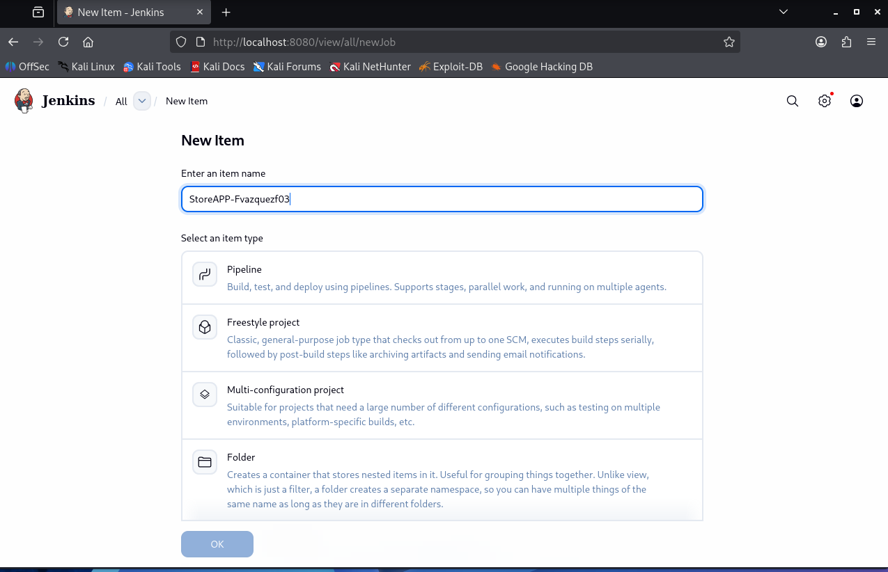

Se accede a **New Item** en Jenkins y se introduce el nombre del pipeline: `StoreAPP-Fvazquezf03`. Se muestran los tipos de proyecto disponibles (Pipeline, Freestyle, Multi-configuration, Folder).

---

## 2. Seleccionar tipo Pipeline

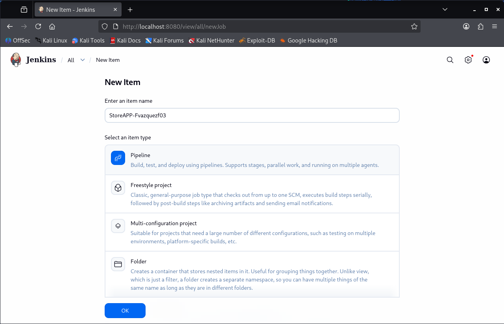

Se selecciona el tipo **Pipeline** (resaltado en azul) para el nuevo ítem y se confirma con el botón **OK**.

---

## 3. Configurar el script del pipeline

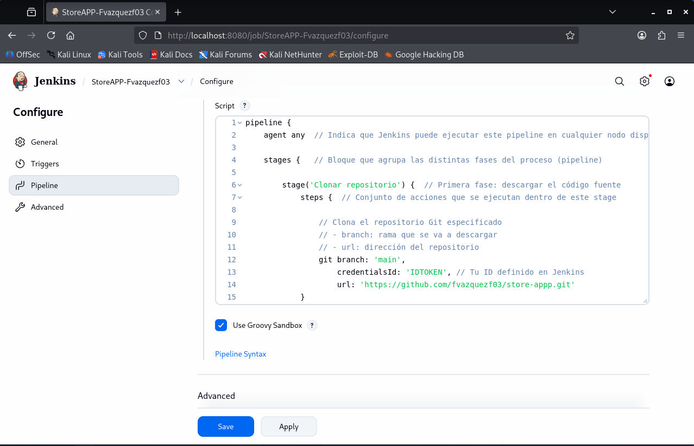

En la sección **Configure → Pipeline**, se define el script Groovy del pipeline. Se puede ver la primera parte del código: el agente (`agent any`), el bloque `stages` y el stage `'Clonar repositorio'`, que hace un `git` checkout desde `https://github.com/fvazquezf03/store-appp.git` usando la credencial `IDTOKEN`.

---

## 4. Primera ejecución exitosa (Build #1)

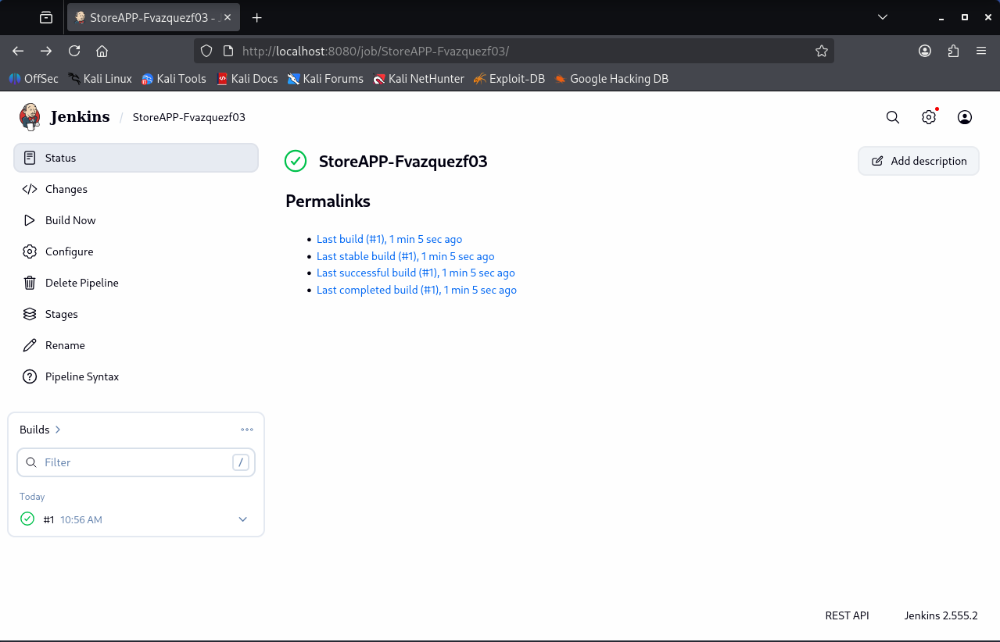

La página de estado del pipeline muestra el **build #1** completado exitosamente hace 1 min 5 seg. Se listan los permalinks: último build, último estable, último exitoso y último completado.

---

## 5. Detalles del Build #1

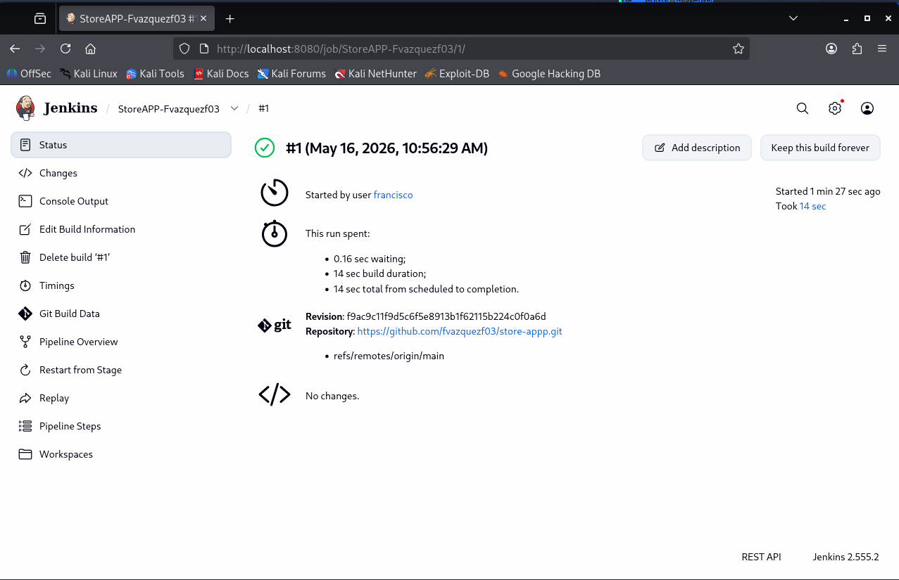

Vista detallada del **build #1** (16 de mayo de 2026, 10:56:29 AM). Fue iniciado por el usuario `francisco`, tardó **14 segundos**, y clonó el repositorio desde `https://github.com/fvazquezf03/store-appp.git` en la rama `refs/remotes/origin/main`. No hubo cambios detectados.

---

## 6. Console Output del Build #1

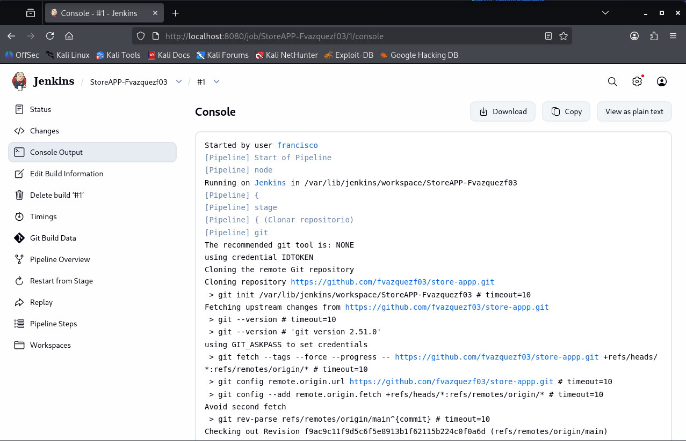

Se visualiza la salida de consola del **build #1**. Jenkins clona el repositorio Git usando la credencial `IDTOKEN`, ejecuta `git fetch`, revisa la rama `main` y hace checkout del commit `f9ac9c11f9d5c6f5e8913b1f62115b224c0f0a6d`.

---

## 7. Vista de Stages del Build #1

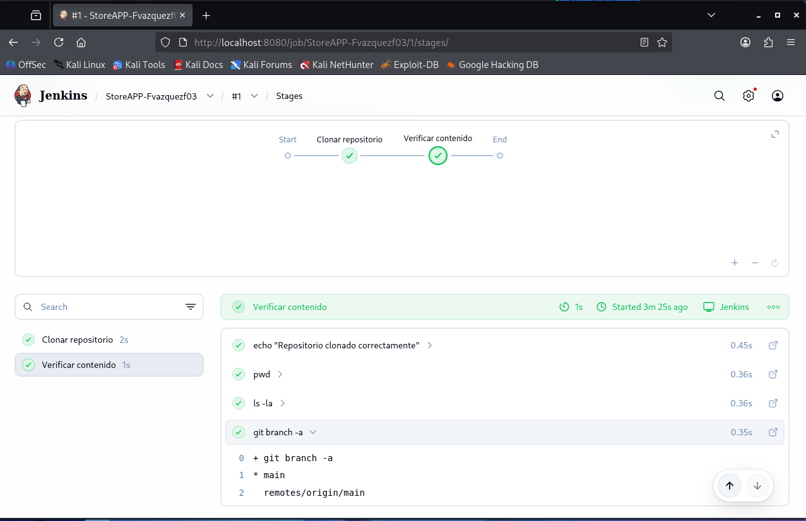

El **Pipeline Overview (Stages)** del build #1 muestra dos stages completados con éxito:
- **Clonar repositorio** (2s)
- **Verificar contenido** (1s)

Se visualiza el detalle del stage *Verificar contenido* con los pasos: `echo`, `pwd`, `ls -la` y `git branch -a`.

---

## 8. Stages Build #1 - Vista completa

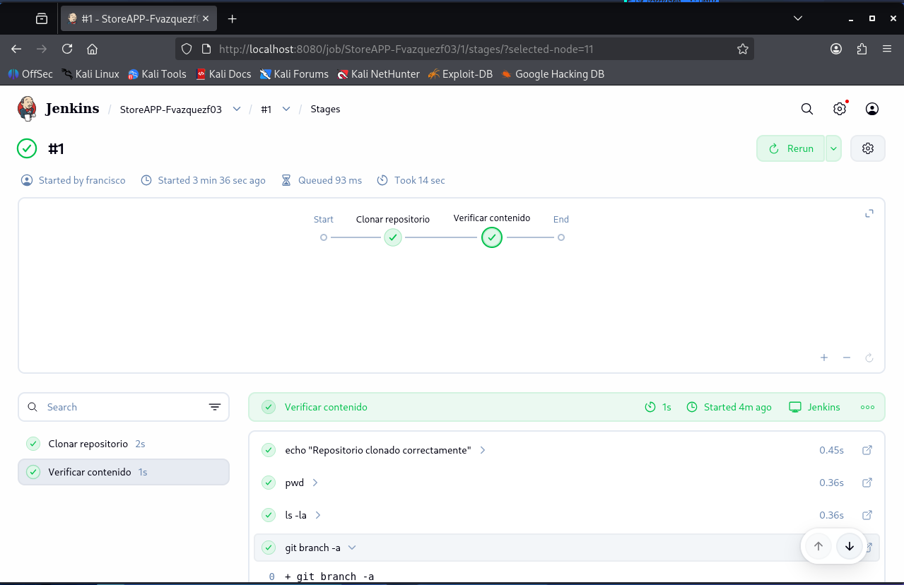

Vista ampliada de los stages del **build #1** con el diagrama de flujo (Start → Clonar repositorio → Verificar contenido → End), todos completados. Se muestra la salida de `git branch -a`: rama activa `* main` y `remotes/origin/main`.

---

## 9. Restart from Stage

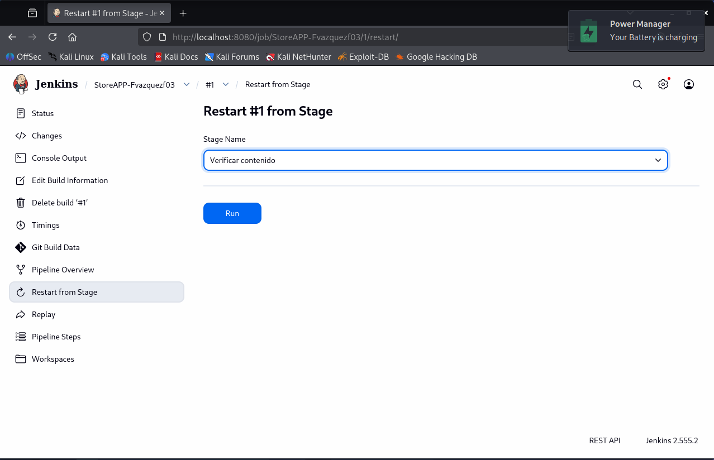

Se utiliza la opción **Restart from Stage** sobre el build #1. Se selecciona el stage `Verificar contenido` desde el menú desplegable y se puede relanzar solo desde ese punto sin repetir el clonado.

---

## 10. Pipeline Steps del Build #2

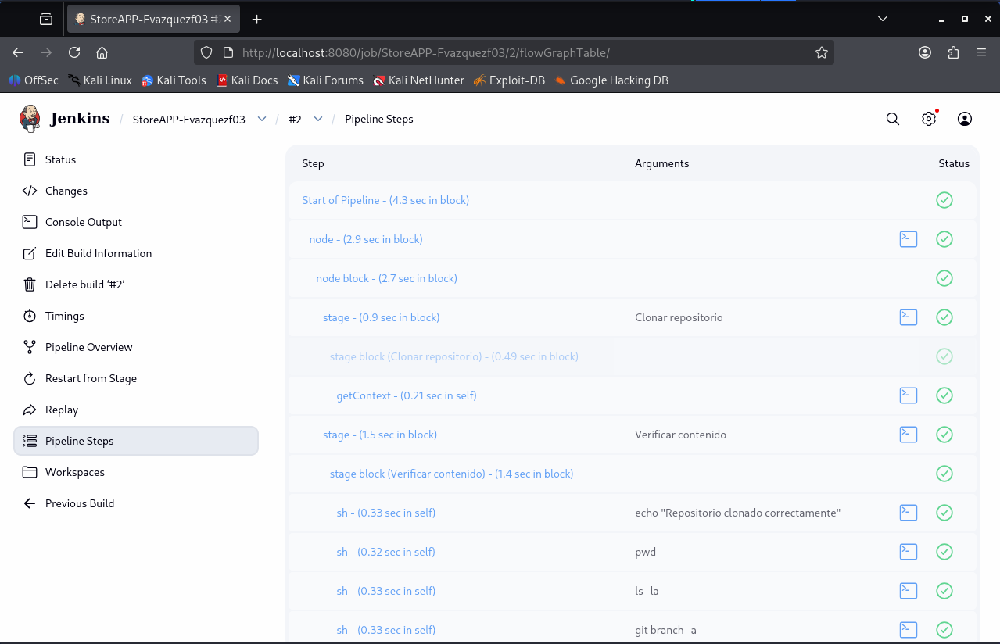

Vista de **Pipeline Steps** del **build #2**. Se listan todos los pasos ejecutados con su duración: `Start of Pipeline`, `node`, `stage (Clonar repositorio)`, `stage (Verificar contenido)`, y los comandos `sh` individuales (`echo`, `pwd`, `ls -la`, `git branch -a`), todos con estado exitoso.

---

## 11. Workspaces del Build #2

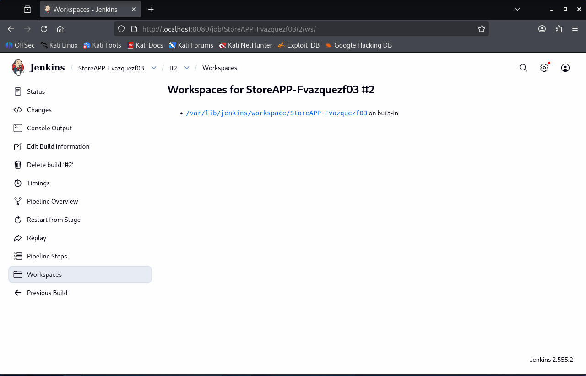

Vista de **Workspaces** del build #2, mostrando la ruta del workspace en el agente built-in: `/var/lib/jenkins/workspace/StoreAPP-Fvazquezf03`.

---

## 12. Estado del pipeline con múltiples builds

La página principal del pipeline muestra el historial de builds del día:
- **#3** ❌ fallido (11:04 AM)
- **#2** ✅ exitoso (11:01 AM)
- **#1** ✅ exitoso (10:56 AM)

Los permalinks apuntan al build #2 como último estable y exitoso.

---

## 13. Error en Build #4 - Syntax Error

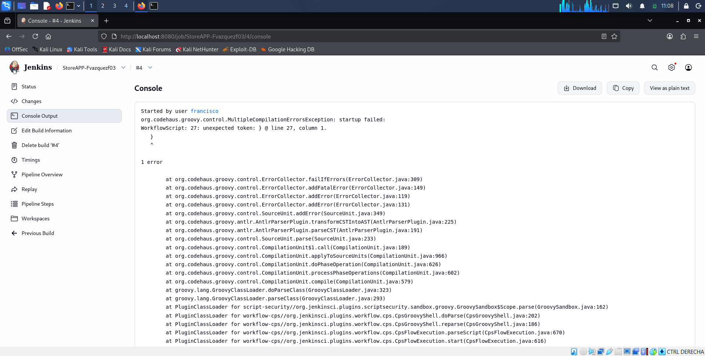

La consola del **build #4** muestra un error de compilación Groovy: `unexpected token: } @ line 27, column 1`. Se trata de un error de sintaxis en el script del pipeline (llave de cierre inesperada), lo que provoca el fallo inmediato del build.

---

## 14. Stages del Build #5 - Fallo en Clonar repositorio

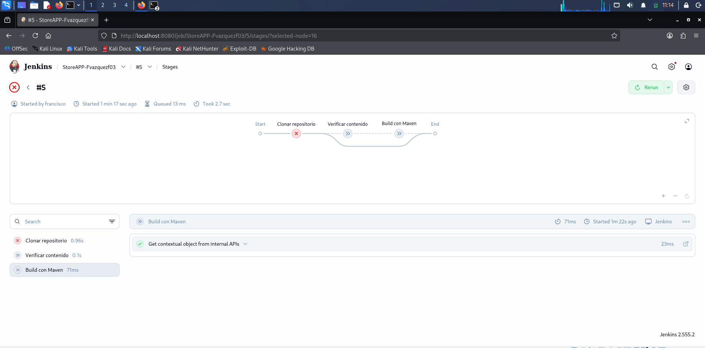

El **build #5** falla en el stage `Clonar repositorio` (marcado con ❌ en rojo). Los stages siguientes (`Verificar contenido`, `Build con Maven`) aparecen como no ejecutados. El build tardó 2.7 segundos en total.

---

## 15. Workspaces del Build #2 (vista alternativa)

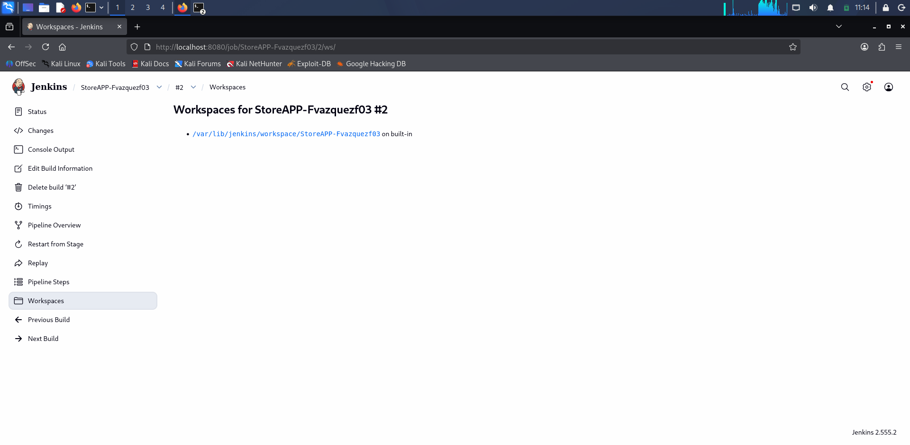

Vista de **Workspaces** del build #2 desde una pantalla diferente, confirmando la ruta `/var/lib/jenkins/workspace/StoreAPP-Fvazquezf03` en el nodo built-in. Muestra también las opciones de navegación: Previous Build y Next Build.

---

## 16. Contenido del Workspace

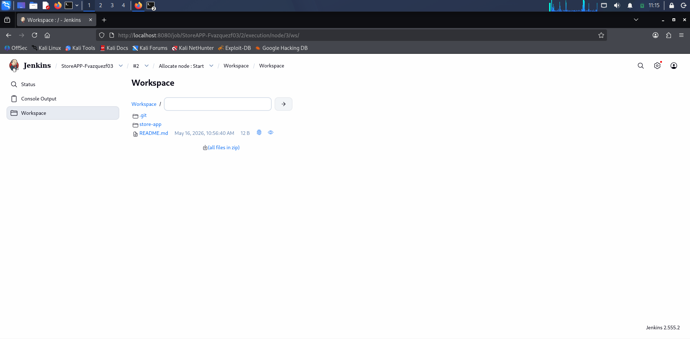

Explorador del **Workspace** del build #2 (accedido desde `Allocate node: Start`). Se visualizan los archivos clonados del repositorio:
- Carpeta `.git`
- Carpeta `store-app`
- Archivo `README.md` (12 B, creado el 16 de mayo de 2026 a las 10:56:40 AM)

También ofrece la opción de descargar todos los archivos en zip.